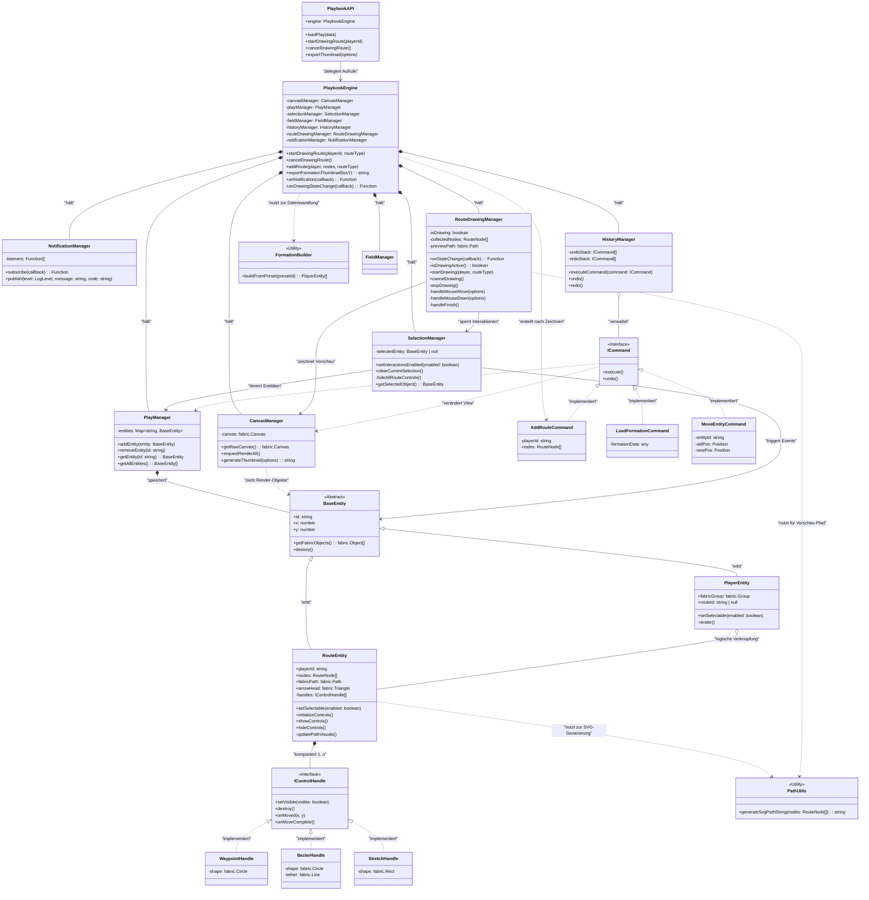

# Class Diagramm Core Package

```mermaid
classDiagram

    %% ==========================================
    %% CORE ENGINE & API
    %% ==========================================

    class PlaybookAPI {
        +engine: PlaybookEngine
        +loadPlay(data)
        +startDrawingRoute(playerId)
        +cancelDrawingRoute()
        +exportThumbnail(options)
    }

    class PlaybookEngine {
        -canvasManager: CanvasManager
        -playManager: PlayManager
        -selectionManager: SelectionManager
        -fieldManager: FieldManager
        -historyManager: HistoryManager
        -routeDrawingManager: RouteDrawingManager
        -notificationManager: NotificationManager
        +startDrawingRoute(playerId, routeType)
        +cancelDrawingRoute()
        +addRoute(player, nodes, routeType)
        +exportFormationThumbnail(losY): string
        +onNotification(callback): Function
        +onDrawingStateChange(callback): Function
    }

    %% ==========================================
    %% MANAGERS
    %% ==========================================

    class NotificationManager {
        -listeners: Function[]
        +subscribe(callback): Function
        +publish(level: LogLevel, message: string, code: string)
    }

    class RouteDrawingManager {
        -isDrawing: boolean
        -collectedNodes: RouteNode[]
        -previewPath: fabric.Path
        +onStateChange(callback): Function
        +isDrawingActive(): boolean
        +startDrawing(player, routeType)
        +cancelDrawing()
        -stopDrawing()
        -handleMouseMove(options)
        -handleMouseDown(options)
        -handleFinish()
    }

    class SelectionManager {
        -selectedEntity: BaseEntity | null
        +setInteractionsEnabled(enabled: boolean)
        +clearCurrentSelection()
        -hideAllRouteControls()
        +getSelectedObject(): BaseEntity
    }

    class CanvasManager {
        -canvas: fabric.Canvas
        +getRawCanvas(): fabric.Canvas
        +requestRenderAll()
        +generateThumbnail(options): string
    }

    class PlayManager {
        -entities: Map~string, BaseEntity~
        +addEntity(entity: BaseEntity)
        +removeEntity(id: string)
        +getEntity(id: string): BaseEntity
        +getAllEntities(): BaseEntity[]
    }

    class HistoryManager {
        -undoStack: ICommand[]
        -redoStack: ICommand[]
        +executeCommand(command: ICommand)
        +undo()
        +redo()
    }

    %% ==========================================
    %% COMMANDS (Command Pattern)
    %% ==========================================

    class ICommand {
        <<Interface>>
        +execute()
        +undo()
    }

    class AddRouteCommand {
        -playerId: string
        -nodes: RouteNode[]
    }

    class LoadFormationCommand {
        -formationData: any
    }

    class MoveEntityCommand {
        -entityId: string
        -oldPos: Position
        -newPos: Position
    }

    %% ==========================================
    %% ENTITIES
    %% ==========================================

    class BaseEntity {
        <<Abstract>>
        +id: string
        +x: number
        +y: number
        +getFabricObjects(): fabric.Object[]
        +destroy()
    }

    class PlayerEntity {
        +fabricGroup: fabric.Group
        +routeId: string | null
        +setSelectable(enabled: boolean)
        -render()
    }

    class RouteEntity {
        +playerId: string
        +nodes: RouteNode[]
        +fabricPath: fabric.Path
        +arrowHead: fabric.Triangle
        -handles: IControlHandle[]
        +setSelectable(enabled: boolean)
        +initializeControls()
        +showControls()
        +hideControls()
        -updatePathVisuals()
    }

    %% ==========================================
    %% ROUTE CONTROLS (UI HANDLES)
    %% ==========================================

    class IControlHandle {
        <<Interface>>
        +setVisible(visible: boolean)
        +destroy()
        +onMoved(x, y)
        +onMoveComplete()
    }

    class WaypointHandle {
        -shape: fabric.Circle
    }

    class BezierHandle {
        -shape: fabric.Circle
        -tether: fabric.Line
    }

    class StretchHandle {
        -shape: fabric.Rect
    }

    %% ==========================================
    %% UTILS / BUILDERS
    %% ==========================================

    class PathUtils {
        <<Utility>>
        +generateSvgPathString(nodes: RouteNode[]): string
    }

    class FormationBuilder {
        <<Utility>>
        +buildFromPreset(presetId): PlayerEntity[]
    }

    %% ==========================================
    %% BEZIEHUNGEN (RELATIONSHIPS)
    %% ==========================================

    %% API to Engine
    PlaybookAPI --> PlaybookEngine : "delegiert Aufrufe"

    %% Engine owns Managers (Composition)
    PlaybookEngine *-- PlayManager : "hält"
    PlaybookEngine *-- CanvasManager : "hält"
    PlaybookEngine *-- SelectionManager : "hält"
    PlaybookEngine *-- FieldManager : "hält"
    PlaybookEngine *-- HistoryManager : "hält"
    PlaybookEngine *-- RouteDrawingManager : "hält"
    PlaybookEngine *-- NotificationManager : "hält"

    %% Manager Dependencies
    RouteDrawingManager --> CanvasManager : "zeichnet Vorschau"
    RouteDrawingManager --> SelectionManager : "sperrt Interaktionen"
    SelectionManager --> PlayManager : "iteriert Entitäten"
    PlaybookEngine ..> AddRouteCommand : "erstellt nach Zeichnen"

    %% Command Pattern Hierarchy
    HistoryManager o-- ICommand : "verwaltet"
    ICommand <|.. AddRouteCommand : "implementiert"
    ICommand <|.. LoadFormationCommand : "implementiert"
    ICommand <|.. MoveEntityCommand : "implementiert"
    ICommand ..> PlayManager : "verändert State"
    ICommand ..> CanvasManager : "verändert View"

    %% Managers and Entities
    PlayManager *-- BaseEntity : "speichert"
    CanvasManager ..> BaseEntity : "zieht Render-Objekte"
    SelectionManager --> BaseEntity : "triggert Events"

    %% Entity Hierarchy
    BaseEntity <|-- PlayerEntity : "erbt"
    BaseEntity <|-- RouteEntity : "erbt"
    PlayerEntity o-- RouteEntity : "logische Verknüpfung"

    %% Handle Composition
    RouteEntity *-- IControlHandle : "komponiert 1..n"
    IControlHandle <|.. WaypointHandle : "implementiert"
    IControlHandle <|.. BezierHandle : "implementiert"
    IControlHandle <|.. StretchHandle : "implementiert"

    %% Utils
    RouteEntity ..> PathUtils : "nutzt zur SVG-Generierung"
    RouteDrawingManager ..> PathUtils : "nutzt für Vorschau-Pfad"
    PlaybookEngine ..> FormationBuilder : "nutzt zur Datenwandlung"
```
